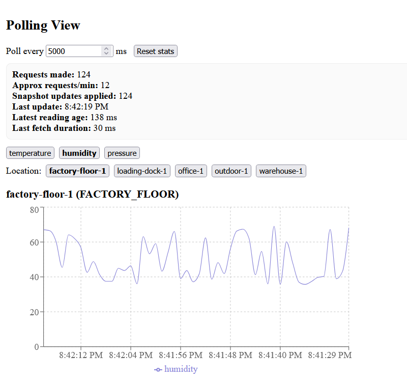
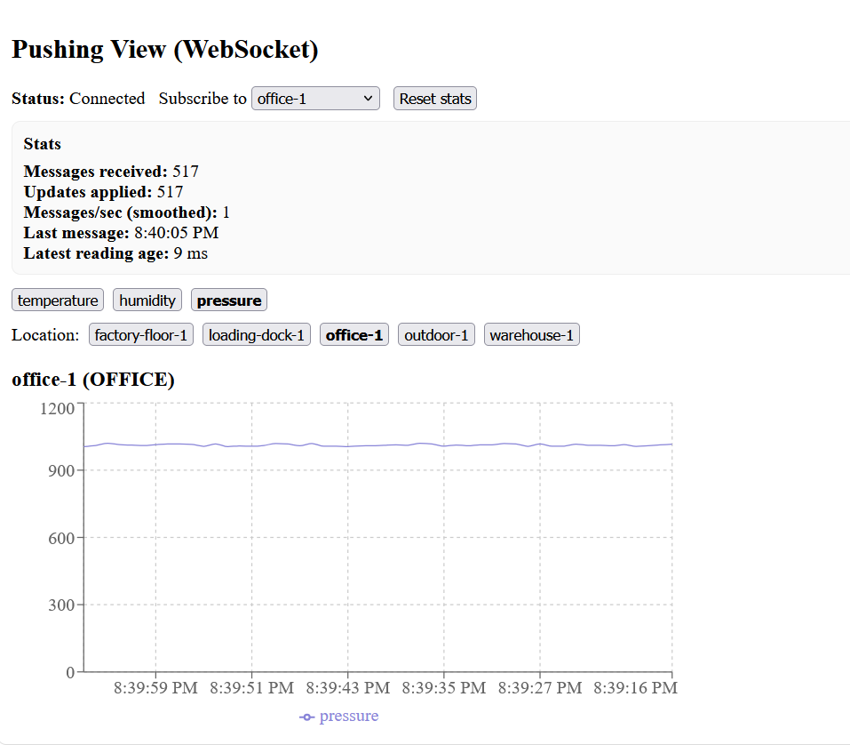

# Kafka Sensor Dashboard - Polling vs Pushing Frontend

A React-based frontend that **compares HTTP polling and WebSocket pushing** for real-time sensor data streamed through Apache Kafka.

This project is designed to visually and practically demonstrate the **differences between request-based polling and event-driven pushing** when building real-time dashboards.

---
## Overview

This dashboard connects to the [kafka-demo](https://github.com/kristinev7/kafka-demo) Spring Boot backend to display sensor readings (temperature, humidity, pressure) in real-time. 

The frontend intentionally implements **two different data delivery strategies**:

1. **Polling View (Top)** – Periodic REST API requests
2. **Pushing View (Bottom)** – Real-time WebSocket updates

Both views display the same underlying Kafka-generated data, but differ in **how updates are delivered**, **how often**, and **how fresh the data is**.

---
## What This Project Demonstrates

### Polling (Request-Based)
- The client **asks the server for updates at a fixed interval**
- Uses REST: `GET /api/sensors/latest`
- May fetch unchanged data
- Update frequency depends on the polling interval
- Simpler to implement, but less efficient at scale

### Pushing (Event-Driven)
- The server **pushes new data immediately** when it becomes available
- Uses WebSockets (STOMP over SockJS)
- No unnecessary requests
- Lower latency and fresher data
- More scalable for real-time systems

This project allows users to **observe and measure these differences directly**.

---
## Tech Stack
- **React 18** - UI library
- **Vite 5** - Build tool with Hot Module Reloading (HMR)
- **Recharts** - Charting library for data visualization
- **WebSockets (STOMP + SockJS)** – Live data pushing

---
## Project Structure

```
kafka-demo-frontend/
├── src/
│   ├── App.jsx                 # Application shell and layout
│   ├── App.css                 # Global application styles
│   ├── Compare.tsx             # Renders Polling (top) and Pushing (bottom) views
│   ├── PollingView.tsx         # REST-based polling implementation with stats
│   ├── PushingView.tsx         # WebSocket-based pushing implementation with stats
│   ├── DisplaySensorData.tsx   # Shared chart component (Recharts)
│   ├── SensorData.jsx          # Legacy single-view polling component
│   ├── RawSensorData.jsx       # Optional raw JSON-style sensor data display
│   ├── main.jsx                # Application entry point
│   └── index.css               # Base styles (if applicable)
│
├── vite.config.js              # Vite configuration with API & WebSocket proxy
├── package.json                # Project dependencies and scripts
├── package-lock.json           # Dependency lock file
└── README.md                   # Project documentation

```

---
## Application Layout

The default page renders both approaches **in a vertical comparison**:

### 1. Polling View (Top)

The polling view periodically fetches snapshots from the backend.

**How it works**
- Calls `GET /api/sensors/latest`
- Polls at a configurable interval (default: 5 seconds)
- Applies updates only when data changes

**Statistics shown**
- Requests made
- Requests per minute
- Snapshot updates applied
- Latest reading age
- Last fetch duration

This highlights how polling can:
- Generate repeated requests
- Introduce delay between updates
- Fetch unchanged data

---
### 2. Pushing View (Bottom – WebSocket)

The pushing view subscribes to live updates from the backend.

**How it works**
- Connects to `/ws` using WebSockets
- Subscribes to location-based topics
- Receives updates immediately when Kafka produces new data

**Statistics shown**
- Messages received
- Updates applied
- Messages per second (smoothed)
- Latest reading age
- Connection status

This demonstrates:
- Near real-time data delivery
- Lower latency
- No unnecessary network requests

---
## API Expectations

The frontend expects sensor data in the following format:

```json
{
  "location-1": [
    {
      "temperature": 23.5,
      "humidity": 65.2,
      "pressure": 1013.25,
      "locationId": "location-1",
      "locationType": "INDOOR",
      "timestamp": "2024-01-15T10:30:00Z"
    }
  ]
}
```

---
## Getting Started

## Prerequisites  
- Node.js 18+
- npm or yarn
- Backend server running on `http://localhost:8080`

### 1. Install Dependencies

```bash
cd kafka-demo-frontend
npm install
```

### 2. Start Development Server

```bash
npm run dev
```

The app will start on `http://localhost:5173`

### 3. Build for Production

```bash
npm run build
npm run preview    # Preview the production build
```

## Available Scripts

| Command | Description |
|---------|-------------|
| `npm run dev` | Start development server with HMR |
| `npm run build` | Build for production |
| `npm run preview` | Preview production build locally |

## Configuration

### API Proxy (vite.config.js)

The development server proxies API requests to the backend:

```javascript
proxy: {
  "/api": {
    target: "http://localhost:8080",
    changeOrigin: true,
  },
}
```

All requests to `/api/*` are forwarded to the Spring Boot backend.

### Changing the Backend URL

To connect to a different backend, edit `vite.config.js`:

```javascript
proxy: {
  "/api": {
    target: "http://your-backend-url:port",
    changeOrigin: true,
  },
}
```

---
## Why Polling vs Pushing Matters

Polling and pushing represent two fundamentally different approaches to real-time data delivery.

This project shows:
- Latency differences
- Network efficiency
- Data freshness
- Scalability trade-offs  

By showing both approaches in the same application, the differences become immediately visible and measurable.

## Related Projects

- [kafka-demo](https://github.com/kristinev7/kafka-demo) - Spring Boot backend with Kafka integration


---


